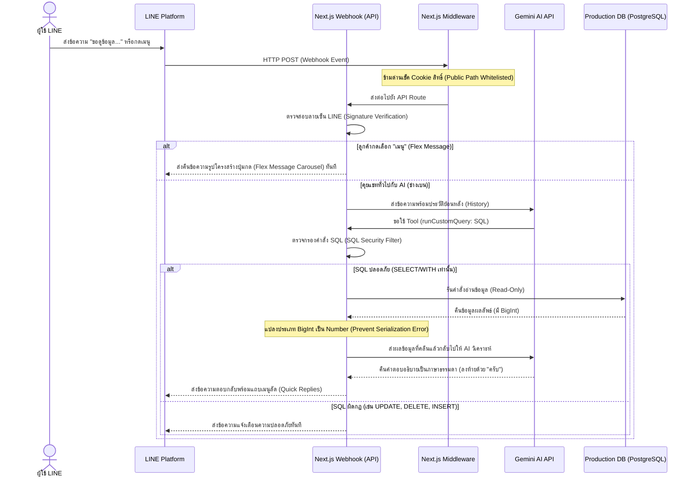

# พิมพ์เขียวและสถาปัตยกรรม: ระบบ LINE Chatbot (AI) คอนเน็กต์ฐานข้อมูลอย่างปลอดภัย (Read-Only)

เอกสารฉบับนี้เป็นคู่มือ (Blueprint) สำหรับนำไปใช้กับโปรเจกต์อื่นๆ เพื่อเชื่อมต่อ LINE Chatbot เข้ากับฐานข้อมูลโดยใช้ AI (เช่น Gemini API) และมีระบบป้องกันความปลอดภัยอย่างสมบูรณ์แบบ (DB Command Prevention) เพื่อไม่ให้ AI หรือผู้ใช้ป้อนคำสั่งแก้ไข/ทำลายฐานข้อมูล Production รวมถึงสถาปัตยกรรมการแสดงผลอินเตอร์เฟสแบบ Premium (Flex Message & Quick Replies) และการตั้งค่า Middleware

---

## 1. ภาพรวมสถาปัตยกรรม (Architecture Overview)



---

## 2. ระบบป้องกันคำสั่งเขียนข้อมูลและแก้ไขบั๊ก BigInt (DB Command & BigInt Safeguard)

เพื่อป้องกันไม่ให้ AI หรือผู้ใช้งานหลอกล่อให้ AI เขียนคำสั่งทำลายข้อมูลในตาราง Production (SQL Jailbreak) และป้องกันไม่ให้เกิดความผิดพลาดในการส่งข้อมูลประเภท `BigInt` (เช่นคำสั่ง `COUNT(*)`) กลับไปยัง AI เราต้องออกแบบฟังก์ชันประมวลผลคำสั่ง SQL ดังนี้:

### โค้ดต้นแบบฟังก์ชันคิวรี่ข้อมูลอย่างปลอดภัย (`bot-queries.ts`)
```typescript
import { PrismaClient } from '@prisma/client'
const prisma = new PrismaClient()

/**
 * แปลงค่า BigInt ทั้งหมดใน Object ให้เป็น Number แบบ Recursive
 * ป้องกันความผิดพลาด TypeError: Do not know how to serialize a BigInt
 */
export function sanitizeBigInt(obj: any): any {
  if (obj === null || obj === undefined) return obj
  if (typeof obj === 'bigint') {
    return Number(obj)
  }
  if (Array.isArray(obj)) {
    return obj.map(sanitizeBigInt)
  }
  if (typeof obj === 'object') {
    const res: Record<string, any> = {}
    for (const key in obj) {
      if (Object.prototype.hasOwnProperty.call(obj, key)) {
        res[key] = sanitizeBigInt(obj[key])
      }
    }
    return res
  }
  return obj
}

export async function runCustomQuery(sqlQuery: string) {
  // 1. ตัด SQL Comments ทั้งแบบบรรทัดเดียว (--) และหลายบรรทัด (/* */) ออกก่อนตรวจสอบ
  const stripped = sqlQuery
    .replace(/--[^\n]*/g, '')
    .replace(/\/\*[\s\S]*?\*\//g, '')
    .trim()
    
  const upper = stripped.toUpperCase()

  // 2. รายชื่อคำต้องห้ามที่เป็นการแก้ไขโครงสร้างหรือข้อมูล
  const forbiddenKeywords = [
    'INSERT', 'UPDATE', 'DELETE', 'DROP', 'ALTER', 'CREATE', 'TRUNCATE',
    'GRANT', 'REVOKE', 'MERGE', 'BULK', 'COPY', 'DO', 'CALL', 'EXECUTE',
    'INTO', 'UPSERT', 'REPLACE', 'DATABASE', 'SCHEMA', 'ROLE', 'USER', 'PASSWORD'
  ]

  // 3. ตรวจสอบหาคำต้องห้ามโดยอ้างอิงขอบเขตคำ (\b)
  for (const word of forbiddenKeywords) {
    if (new RegExp('\\b' + word + '\\b', 'i').test(upper)) {
      return { error: `⛔ ตรวจพบคำสั่งที่ไม่ปลอดภัย (${word}) ระบบอนุญาตเฉพาะ SELECT/WITH อ่านข้อมูลเท่านั้นครับ` }
    }
  }

  // 4. บังคับว่าคำสั่งต้องเริ่มต้นด้วย SELECT หรือ WITH เท่านั้น
  const isSelect = upper.startsWith('SELECT') || upper.startsWith('WITH')
  if (!isSelect) {
    return { error: '⛔ คำสั่งต้องขึ้นต้นด้วย SELECT หรือ WITH เท่านั้นครับ' }
  }

  // 5. ป้องกันคำสั่งซ้อน (Chained Queries) โดยห้ามมีเครื่องหมาย Semicolon (;)
  if (stripped.includes(';')) {
    return { error: '⛔ ไม่อนุญาตให้รัน SQL หลายคำสั่งพร้อมกัน (ห้ามมีเครื่องหมาย ;)' }
  }

  try {
    // รันคำสั่งแบบ Read-Only
    const result = await prisma.$queryRawUnsafe(stripped) as any[]
    
    // จำกัดจำนวนแถวที่ส่งกลับไปหา AI เพื่อป้องกันปัญหา Token บวม
    const rows = result.slice(0, 20)
    
    // แปลงโครงสร้าง BigInt ก่อนทำ JSON.stringify
    const sanitizedRows = sanitizeBigInt(rows)
    
    return {
      rowCount: result.length,
      shownRows: rows.length,
      data: sanitizedRows,
    }
  } catch (err: any) {
    return { error: `เกิดข้อผิดพลาดในการดึงข้อมูล: ${err.message}` }
  }
}
```

---

## 3. โครงสร้างฐานข้อมูลสำหรับเก็บข้อมูล LINE Bot (Database Schema Pattern)

ควรเก็บข้อมูลการใช้งานและประวัติการสนทนาของ AI เพื่อใช้เป็นประวัติอ้างอิงบริบท (Context History) และเก็บข้อมูลกลุ่ม/ผู้ใช้เพื่อใช้ทำระบบส่งการแจ้งเตือน (Push Notifications) ภายหลัง

```prisma
// ตารางต้นแบบสำหรับ Prisma (PostgreSQL / MySQL)

model LineUser {
  id             String   @id @default(cuid())
  lineUserId     String   @unique @map("line_user_id") @db.VarChar(50)
  displayName    String?  @map("display_name") @db.VarChar(255)
  pictureUrl     String?  @map("picture_url") @db.Text
  statusMessage  String?  @map("status_message") @db.VarChar(255)
  system         String   @default("EXPERT") @map("system") @db.VarChar(50) // แยกชื่อระบบ
  isActive       Boolean  @default(true) @map("is_active")
  role           String   @default("USER") @map("role") @db.VarChar(20) // ADMIN หรือ USER
  userId         String?  @map("user_id") // เชื่อมตาราง User ระบบหลัก (ถ้ามี)
  registeredAt   DateTime @default(now()) @map("registered_at")
  updatedAt      DateTime @updatedAt @map("updated_at")

  @@map("line_users")
}

model LineGroup {
  id             String   @id @default(cuid())
  groupId        String   @unique @map("group_id") @db.VarChar(50)
  groupName      String?  @map("group_name") @db.VarChar(255)
  groupType      String   @default("group") @map("group_type") @db.VarChar(20) // group หรือ room
  isActive       Boolean  @default(true) @map("is_active")
  createdAt      DateTime @default(now()) @map("created_at")
  updatedAt      DateTime @updatedAt @map("updated_at")

  @@map("line_groups")
}

model ChatLog {
  id             String   @id @default(cuid())
  sourceType     String   @map("source_type") @db.VarChar(20) // user (แชทเดี่ยว), group (กลุ่ม), room (ห้องแชท)
  sourceId       String?  @map("source_id") @db.VarChar(50) // Line ID ของจุดที่ส่งข้อความ
  userName       String?  @map("user_name") @db.VarChar(255) // ชื่อเล่น/ชื่อแสดงในไลน์
  userMessage    String   @map("user_message") @db.Text // ข้อความที่ผู้ใช้พิมพ์ถาม
  botReply       String   @map("bot_reply") @db.Text // ข้อความที่บอทตอบกลับ
  inputTokens    Int?     @map("input_tokens") // จำนวน token ขาเข้า
  outputTokens   Int?     @map("output_tokens") // จำนวน token ขาออก
  modelName      String?  @map("model_name") @db.VarChar(50) // รุ่น AI เช่น gemini-3.5-flash
  responseTimeMs Int?     @map("response_time_ms") // ความเร็วในการตอบสนอง (มิลลิวินาที)
  createdAt      DateTime @default(now()) @map("created_at")

  @@map("chat_logs")
}
```

---

## 4. ระบบวิเคราะห์บริบทและการใช้ Tool (Gemini AI Client Pattern)

เมื่อได้รับข้อความเข้ามา AI จะพิจารณาว่าจำเป็นต้องดึงข้อมูลจาก DB หรือไม่ หากจำเป็นจะเรียกฟังก์ชัน `runCustomQuery` เพื่อรันคำสั่ง SQL ที่ปลอดภัย โครงสร้างการคืนค่า Tool Response ต้องเป็นโครงสร้าง `functionResponse` ที่ตรงตามสเปกของ Google Generative AI SDK:

```typescript
import { GoogleGenerativeAI, SchemaType } from '@google/generative-ai'
import { runCustomQuery } from './bot-queries'

const genAI = new GoogleGenerativeAI(process.env.GEMINI_API_KEY || '')

export async function askBen(userMessage: string, history: any[]) {
  const model = genAI.getGenerativeModel({
    model: 'gemini-3.5-flash',
    systemInstruction: `คุณคือ "ช่างเบน" บอทวิเคราะห์ฐานข้อมูลระบบ... สุภาพ ลงท้ายด้วยครับ`,
    tools: [{
      functionDeclarations: [
        {
          name: 'runCustomQuery',
          description: 'รันคำสั่ง SQL PostgreSQL เพื่อดึงข้อมูลประกอบการตอบคำถามผู้ใช้',
          parameters: {
            type: SchemaType.OBJECT,
            properties: {
              sqlQuery: {
                type: SchemaType.STRING,
                description: 'คำสั่ง SQL PostgreSQL แท้ๆ (SELECT/WITH เท่านั้น)'
              }
            },
            required: ['sqlQuery']
          }
        }
      ]
    }]
  })

  const chat = model.startChat({ history })
  let response = await chat.sendMessage(userMessage)
  let iterations = 0
  const maxIterations = 5

  while (iterations < maxIterations) {
    const candidate = response.response.candidates?.[0]
    const functionCalls = candidate?.content?.parts?.filter(p => p.functionCall) || []
    
    if (functionCalls.length === 0) break

    const functionResponses = []
    for (const call of functionCalls) {
      const fc = call.functionCall!
      let result: any

      if (fc.name === 'runCustomQuery') {
        const args = fc.args as { sqlQuery: string }
        result = await runCustomQuery(args.sqlQuery)
      } else {
        result = { error: 'Unknown tool call' }
      }

      // รูปแบบที่ถูกต้องในการส่งผลลัพธ์กลับไปให้ AI SDK
      functionResponses.push({
        functionResponse: {
          name: fc.name,
          response: result as object
        }
      })
    }

    response = await chat.sendMessage(functionResponses)
    iterations++
  }

  return {
    text: response.response.text(),
    inputTokens: response.response.usageMetadata?.promptTokenCount || 0,
    outputTokens: response.response.usageMetadata?.candidatesTokenCount || 0
  }
}
```

---

## 5. อินเตอร์เฟสระดับพรีเมียม (Quick Replies & Flex Carousel Menu)

การสร้างประสบการณ์ใช้งานที่ยอดเยี่ยมแก่ผู้ใช้งาน (WOW Experience) สามารถทำได้โดยแนบเมนูลัด **Quick Reply** ไปกับทุกข้อความตอบกลับ และสร้าง **Flex Message Carousel** เพื่อเป็นเมนูตัวเลือกสำหรับให้ผู้ใช้สามารถกดใช้คำสั่งต่างๆ ได้ง่าย

### โค้ดส่งข้อความและสร้างปุ่มกดลัด (`src/lib/line.ts`)
```typescript
export const quickReplyItems = {
  items: [
    {
      type: 'action',
      action: {
        type: 'message',
        label: '📊 สรุปสถิติเคลม',
        text: 'ช่างเบน สรุปสถิติเคลมหน่อยครับ'
      }
    },
    {
      type: 'action',
      action: {
        type: 'message',
        label: '🔧 สรุปงานซ่อมค้าง',
        text: 'ช่างเบน สรุปงานซ่อมค้างทั้งหมดให้หน่อยครับ'
      }
    },
    {
      type: 'action',
      action: {
        type: 'message',
        label: '📖 แนะนำวิธีใช้งาน',
        text: 'ช่างเบน แนะนำวิธีใช้งานหน่อยครับ'
      }
    }
  ]
}

export async function replyMessage(replyToken: string, messages: any[]) {
  await fetch('https://api.line.me/v2/bot/message/reply', {
    method: 'POST',
    headers: {
      'Content-Type': 'application/json',
      'Authorization': `Bearer ${process.env.LINE_CHANNEL_ACCESS_TOKEN}`
    },
    body: JSON.stringify({ replyToken, messages })
  })
}

export async function replyText(replyToken: string, text: string) {
  // แนบ Quick Reply ไปกับทุกข้อความ Text เพื่อความสะดวกของผู้ใช้งาน
  await replyMessage(replyToken, [{
    type: 'text',
    text,
    quickReply: quickReplyItems
  }])
}

export function getMenuMessage() {
  const liffUrl = `https://liff.line.me/${process.env.NEXT_PUBLIC_LINE_LIFF_ID}`
  return {
    type: 'flex',
    altText: '📖 เมนูคำสั่งช่างเบน (Ben Bot)',
    contents: {
      type: 'carousel',
      contents: [
        // Bubble 1: แนะนำวิธีการพิมพ์
        {
          type: 'bubble',
          size: 'mega',
          header: {
            type: 'box',
            layout: 'vertical',
            contents: [
              { type: 'text', text: '🤖 ช่างเบน (Ben Bot)', weight: 'bold', size: 'xl', color: '#ffffff' },
              { type: 'text', text: 'ผู้ช่วยระบบงานเคลมและใบสั่งซ่อมสี', size: 'xs', color: '#FFE0B2', margin: 'xs' }
            ],
            backgroundColor: '#FF6D00',
            paddingAll: 'lg'
          },
          body: {
            type: 'box',
            layout: 'vertical',
            spacing: 'md',
            contents: [
              { type: 'text', text: '💡 วิธีพิมพ์สั่งการ', weight: 'bold', size: 'sm', color: '#FF6D00' },
              {
                type: 'box',
                layout: 'vertical',
                spacing: 'xs',
                contents: [
                  {
                    type: 'box',
                    layout: 'horizontal',
                    contents: [
                      { type: 'text', text: '• แชทเดี่ยว:', size: 'xs', weight: 'bold', color: '#555555', flex: 3 },
                      { type: 'text', text: 'พิมพ์ถามได้ตรงๆ เลยครับ', size: 'xs', color: '#666666', flex: 7 }
                    ]
                  },
                  {
                    type: 'box',
                    layout: 'horizontal',
                    contents: [
                      { type: 'text', text: '• แชทกลุ่ม:', size: 'xs', weight: 'bold', color: '#555555', flex: 3 },
                      { type: 'text', text: 'พิมพ์ "ช่างเบน" นำหน้าคำถามครับ', size: 'xs', color: '#666666', flex: 7 }
                    ]
                  }
                ]
              }
            ],
            paddingAll: 'lg'
          }
        },
        // Bubble 2: รายงานการเคลมสี
        {
          type: 'bubble',
          size: 'mega',
          header: {
            type: 'box',
            layout: 'vertical',
            contents: [
              { type: 'text', text: '📊 งานเคลม & สถิติสี', weight: 'bold', size: 'lg', color: '#ffffff' },
              { type: 'text', text: 'ดูสถิติและข้อมูลเคลมรถยนต์หลัก', size: 'xs', color: '#DBEAFE', margin: 'xs' }
            ],
            backgroundColor: '#2563EB',
            paddingAll: 'lg'
          },
          body: {
            type: 'box',
            layout: 'vertical',
            spacing: 'md',
            contents: [
              {
                type: 'box',
                layout: 'horizontal',
                action: { type: 'message', label: 'สรุปสถิติเคลม', text: 'ช่างเบน สรุปสถิติเคลมหน่อยครับ' },
                contents: [
                  { type: 'text', text: '📊 สรุปสถิติเคลม', size: 'xs', weight: 'bold', color: '#2563EB', flex: 6 },
                  { type: 'text', text: 'ดูยอดวิเคราะห์ใบเคลม', size: 'xs', color: '#888888', align: 'end', flex: 4 }
                ]
              }
            ],
            paddingAll: 'lg'
          },
          footer: {
            type: 'box',
            layout: 'vertical',
            paddingAll: 'lg',
            contents: [
              {
                type: 'button',
                style: 'primary',
                color: '#2563EB',
                height: 'sm',
                action: { type: 'uri', label: '📊 เปิดดูแดชบอร์ด', uri: `${liffUrl}?path=/dashboard` }
              }
            ]
          }
        }
      ]
    }
  }
}
```

---

## 6. การกำหนดสิทธิ์เข้าถึงสาธารณะของ Webhook ใน Next.js Middleware

ในระบบที่มีการใช้ JWT/Cookie Auth ป้องกัน API ทั้งหมดใน Middleware สัญญาณเรียกเข้า (POST Webhook) จาก LINE Platform จะถูกบล็อกจนทำให้เกิดข้อผิดพลาด `401 Unauthorized` ทันที เนื่องจากบอทของ LINE ไม่มี Cookie รหัสผ่านของเรา จึงจำเป็นต้องยกเว้นเส้นทาง Webhook ไว้ดังนี้:

### โค้ดต้นแบบของ Middleware (`middleware.ts`)
```typescript
import { NextResponse } from 'next/server'
import type { NextRequest } from 'next/server'

export async function middleware(request: NextRequest) {
  const { pathname } = request.nextUrl

  // 1. ระบุรายชื่อ Path ที่ข้ามด่านการตรวจเช็ค Token/Cookie ได้
  const isPublicPath = 
    pathname === '/login' ||
    pathname.startsWith('/api/auth/') ||
    pathname.startsWith('/api/line/webhook') || // ยกเว้น LINE Webhook
    pathname.startsWith('/_next') ||
    pathname.includes('.')

  if (isPublicPath) {
    return NextResponse.next()
  }

  // 2. ด่านการตรวจสิทธิ์และ Cookies ปกติ
  const token = request.cookies.get('expert-token')?.value
  if (!token) {
    if (pathname.startsWith('/api/')) {
      return NextResponse.json({ error: 'Unauthorized' }, { status: 401 })
    }
    return NextResponse.redirect(new URL('/login', request.url))
  }

  return NextResponse.next()
}

export const config = {
  matcher: [
    '/((?!_next/static|_next/image|favicon.ico).*)',
  ],
}
```

---

## 7. สรุปเช็คลิสต์ขั้นตอนการนำไปประยุกต์ใช้ (Implementation Checklist)

1. [ ] **ตั้งค่า `.env`**: บันทึก `GEMINI_API_KEY`, `LINE_CHANNEL_SECRET`, และ `LINE_CHANNEL_ACCESS_TOKEN`
2. [ ] **เขียนโมเดลใน `schema.prisma`**: ปรับแต่งตาราง LINE บอทตามโปรเจกต์
3. [ ] **รัน Migration แบบปลอดภัย**: สร้างและ Deploy ด้วยคำสั่ง `prisma migrate`
    > [!CAUTION]
    > **ข้อควรระวังอย่างยิ่งเกี่ยวกับขั้นตอนการซิงก์ฐานข้อมูล (Database Sync Safeguard)**:
    > ก่อนเริ่มทำการซิงก์ตารางใหม่ลงสู่ฐานข้อมูล ให้ดำเนินการตรวจสอบก่อนเสมอว่าโปรเจกต์เป้าหมายใช้แนวทางการย้ายข้อมูลแบบใด: หากโปรเจกต์ใช้ **Prisma Migrate** (มีโฟลเดอร์ `prisma/migrations`) **ต้องใช้คำสั่ง `prisma migrate` เท่านั้น** ห้ามใช้ `db push` เด็ดขาด เพื่อป้องกันความเสียหายของข้อมูลเดิมบน Production
4. [ ] **ยกเว้น Webhook ใน `middleware.ts`**: เพิ่ม `/api/line/webhook` ไปในข้อยกเว้น Public Path เพื่อเลี่ยงข้อผิดพลาด 401
5. [ ] **สร้างไฟล์ควบคุมความปลอดภัย SQL (`bot-queries.ts`)**: คัดลอกระบบฟิลเตอร์คำต้องห้าม, บล็อก Chained Query และทำการกรองแปลง `BigInt` ป้องกันข้อผิดพลาดในการแปลงเป็น JSON
6. [ ] **เขียนฟังก์ชันเชื่อมต่อ AI (`gemini.ts`)**: ระบุวิธีการดึงข้อมูลอ้างอิง และแปลงค่าส่งกลับ Tool ด้วยฟังก์ชันโครงสร้าง `functionResponse`
7. [ ] **สร้าง Webhook API Route (`route.ts`)**: เชื่อมเส้นทางของ LINE Developers เข้ากับเซิร์ฟเวอร์ โดยส่ง HTTP 200 ทันทีแล้วย้ายงานรันด้วย Pattern Background Worker เพื่อไม่ให้เกิดปัญหาสายหลุด (Timeout)
8. [ ] **ติดตั้ง Flex Carousel และ Quick Menu**: เพื่อเพิ่มความง่ายและสะดวกในการคิวรี่รายงานสถิติต่างๆ แบบ WOW Design
