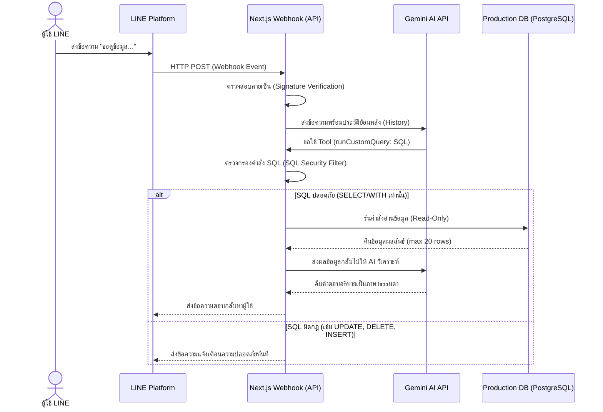

# พิมพ์เขียวและสถาปัตยกรรม: ระบบ LINE Chatbot (AI) คอนเน็กต์ฐานข้อมูลอย่างปลอดภัย (Read-Only)

เอกสารฉบับนี้เป็นคู่มือ (Blueprint) สำหรับนำไปใช้กับโปรเจกต์อื่นๆ เพื่อเชื่อมต่อ LINE Chatbot เข้ากับฐานข้อมูลโดยใช้ AI (เช่น Gemini API) และมีระบบป้องกันความปลอดภัยอย่างสมบูรณ์แบบ (DB Command Prevention) เพื่อไม่ให้ AI หรือผู้ใช้ป้อนคำสั่งแก้ไข/ทำลายฐานข้อมูล Production

---

## 1. ภาพรวมสถาปัตยกรรม (Architecture Overview)



---

## 2. ระบบป้องกันคำสั่งเขียนข้อมูล (Database Command Prevention)

เพื่อป้องกันไม่ให้ AI หรือผู้ใช้งานหลอกล่อให้ AI เขียนคำสั่งทำลายข้อมูลในตาราง Production (SQL Injection / Jailbreak) เราต้องสร้างระบบตรวจสอบคำสั่ง SQL ที่เข้มงวดที่สุดในฝั่งแอปพลิเคชัน (Code-Level Safeguard)

### โค้ดต้นแบบฟังก์ชันคิวรี่ข้อมูลอย่างปลอดภัย (TypeScript)
```typescript
import { PrismaClient } from '@prisma/client'
const prisma = new PrismaClient()

export async function runCustomQuery(sqlQuery: string) {
  // 1. ตัด SQL Comments ทั้งแบบบรรทัดเดียว (--) และหลายบรรทัด (/* */) ออกก่อนตรวจสอบ
  // เพื่อป้องกันการซ่อนคำสั่งไว้ข้างหลังคอมเมนต์
  const stripped = sqlQuery
    .replace(/--[^\n]*/g, '')
    .replace(/\/\*[\s\S]*?\*\//g, '')
    .trim()
    
  const upper = stripped.toUpperCase()

  // 2. รายชื่อคำต้องห้ามที่เป็นการแก้ไขโครงสร้างหรือข้อมูล
  const forbiddenKeywords = [
    'INSERT', 'UPDATE', 'DELETE', 'DROP', 'ALTER', 'CREATE', 'TRUNCATE',
    'GRANT', 'REVOKE', 'MERGE', 'BULK', 'COPY', 'DO', 'CALL', 'EXECUTE',
    'INTO', 'UPSERT', 'REPLACE', 'DATABASE', 'SCHEMA', 'ROLE', 'USER', 'PASSWORD'
  ]

  // 3. ตรวจสอบหาคำต้องห้ามโดยอ้างอิงขอบเขตคำ (\b) เพื่อป้องกันไม่ให้กระทบคำที่สะกดใกล้เคียงกัน
  for (const word of forbiddenKeywords) {
    if (new RegExp('\\b' + word + '\\b', 'i').test(upper)) {
      return { error: `⛔ ตรวจพบคำสั่งที่ไม่ปลอดภัย (${word}) ระบบอนุญาตเฉพาะ SELECT เท่านั้น` }
    }
  }

  // 4. บังคับว่าคำสั่งต้องเริ่มต้นด้วย SELECT หรือ WITH (สำหรับ CTE Read Queries) เท่านั้น
  const isSelect = upper.startsWith('SELECT') || upper.startsWith('WITH')
  if (!isSelect) {
    return { error: '⛔ คำสั่งต้องขึ้นต้นด้วย SELECT หรือ WITH เท่านั้น' }
  }

  // 5. ป้องกันคำสั่งซ้อน (Chained Queries) โดยห้ามมีเครื่องหมาย Semicolon (;)
  if (stripped.includes(';')) {
    return { error: '⛔ ไม่อนุญาตให้รัน SQL หลายคำสั่งพร้อมกัน (ห้ามใช้เครื่องหมาย ;)' }
  }

  try {
    // รันคำสั่งแบบ Read-Only
    const result = await prisma.$queryRawUnsafe(sqlQuery) as any[]
    
    // จำกัดจำนวนบรรทัดที่ส่งกลับไปหา AI เพื่อป้องกันปัญหา Token บวม
    const rows = result.slice(0, 20)
    
    return {
      rowCount: result.length,
      shownRows: rows.length,
      data: rows,
    }
  } catch (err: any) {
    return { error: `เกิดข้อผิดพลาดในการดึงข้อมูล: ${err.message}` }
  }
}
```

---

## 3. โครงสร้างฐานข้อมูลสำหรับเก็บข้อมูล LINE Bot (Database Schema Pattern)

การทำ LINE Bot ที่มีประสิทธิภาพควรเก็บข้อมูลการใช้งานและประวัติการสนทนาของ AI เพื่อใช้อ้างอิงบริบท (Context History) และเก็บข้อมูลกลุ่ม/ผู้ใช้เพื่อใช้ทำระบบแจ้งเตือน (Notifications)

```prisma
// โครงสร้างตารางต้นแบบสำหรับ Prisma (PostgreSQL / MySQL)

model LineUser {
  id             String   @id @default(cuid())
  lineUserId     String   @unique @map("line_user_id") @db.VarChar(50)
  displayName    String?  @map("display_name") @db.VarChar(255)
  pictureUrl     String?  @map("picture_url") @db.Text
  statusMessage  String?  @map("status_message") @db.VarChar(255)
  system         String   @default("EXPERT") @map("system") @db.VarChar(50) // แยกชื่อระบบ
  isActive       Boolean  @default(true) @map("is_active")
  role           String   @default("USER") @map("role") @db.VarChar(20) // ADMIN หรือ USER
  userId         String?  @map("user_id") // เชื่อมตาราง User ระบบหลัก (ถ้ามี)
  registeredAt   DateTime @default(now()) @map("registered_at")
  updatedAt      DateTime @updatedAt @map("updated_at")

  @@map("line_users")
}

model LineGroup {
  id             String   @id @default(cuid())
  groupId        String   @unique @map("group_id") @db.VarChar(50)
  groupName      String?  @map("group_name") @db.VarChar(255)
  groupType      String   @default("group") @map("group_type") @db.VarChar(20) // group หรือ room
  isActive       Boolean  @default(true) @map("is_active")
  createdAt      DateTime @default(now()) @map("created_at")
  updatedAt      DateTime @updatedAt @map("updated_at")

  @@map("line_groups")
}

model ChatLog {
  id             String   @id @default(cuid())
  sourceType     String   @map("source_type") @db.VarChar(20) // user (แชทเดี่ยว), group (กลุ่ม), room (ห้องแชท)
  sourceId       String?  @map("source_id") @db.VarChar(50) // Line ID ของจุดที่ส่งข้อความ
  userName       String?  @map("user_name") @db.VarChar(255) // ชื่อเล่น/ชื่อแสดงในไลน์
  userMessage    String   @map("user_message") @db.Text // ข้อความที่ผู้ใช้พิมพ์ถาม
  botReply       String   @map("bot_reply") @db.Text // ข้อความที่บอทตอบกลับ
  inputTokens    Int?     @map("input_tokens") // จำนวน token ขาเข้า
  outputTokens   Int?     @map("output_tokens") // จำนวน token ขาออก
  modelName      String?  @map("model_name") @db.VarChar(50) // รุ่น AI เช่น gemini-3.5-flash
  responseTimeMs Int?     @map("response_time_ms") // ความเร็วในการตอบสนอง (มิลลิวินาที)
  createdAt      DateTime @default(now()) @map("created_at")

  @@map("chat_logs")
}
```

---

## 4. ระบบวิเคราะห์บริบทและการใช้ Tool (Gemini AI Client)

เมื่อได้รับข้อความเข้ามา AI จะพิจารณาว่าจำเป็นต้องดึงข้อมูลจาก DB หรือไม่ หากจำเป็นมันจะเรียกฟังก์ชัน `runCustomQuery` เพื่อรันคำสั่ง SQL ที่ปลอดภัย

```typescript
import { GoogleGenerativeAI } from '@google/generative-ai'
import { runCustomQuery } from './bot-queries'

const genAI = new GoogleGenerativeAI(process.env.GEMINI_API_KEY)

const SYSTEM_PROMPT = `คุณคือ "ช่างเบน" บอทวิเคราะห์ฐานข้อมูลระบบ...
หน้าที่ของคุณคือช่วยตอบคำถามของผู้ใช้งานโดยวิเคราะห์จากฐานข้อมูล

กฎสำคัญ:
- ถ้าผู้ใช้ถามหาข้อมูลในตาราง ให้เรียกฟังก์ชัน 'runCustomQuery' เพื่อดึงข้อมูลด้วยคำสั่ง SELECT
- ห้ามดึงพาสเวิร์ดผู้ใช้เด็ดขาด
- ให้ตอบคำถามอย่างเป็นมิตร สุภาพ ลงท้ายด้วยครับ`

export async function askBen(userMessage: string, history: any[], userContext: any) {
  const model = genAI.getGenerativeModel({
    model: 'gemini-3.5-flash',
    systemInstruction: SYSTEM_PROMPT,
    // ประกาศฟังก์ชันให้ AI สามารถเรียกใช้ได้ (Function Calling)
    tools: [{
      functionDeclarations: [
        {
          name: 'runCustomQuery',
          description: 'รันคำสั่ง SQL (เฉพาะ SELECT เท่านั้น) เพื่อดึงข้อมูลประกอบการตอบคำถามผู้ใช้',
          parameters: {
            type: 'OBJECT',
            properties: {
              sqlQuery: {
                type: 'STRING',
                description: 'คำสั่ง SQL ภาษา PostgreSQL แท้ๆ ที่เป็น SELECT เพื่อดึงข้อมูล'
              }
            },
            required: ['sqlQuery']
          }
        }
      ]
    }]
  })

  const chat = model.startChat({ history })
  let response = await chat.sendMessage(userMessage)

  let iterations = 0
  const maxIterations = 5

  // วนลูปรับคำขอใช้ Tool จาก AI (จนกว่า AI จะได้ข้อมูลครบถ้วนแล้วตอบเป็นข้อความธรรมดา)
  while (iterations < maxIterations) {
    const candidate = response.response.candidates?.[0]
    const functionCalls = candidate?.content?.parts?.filter(p => p.functionCall) || []
    
    if (functionCalls.length === 0) break

    const functionResponses = []
    for (const call of functionCalls) {
      const fc = call.functionCall!
      let result: any

      if (fc.name === 'runCustomQuery') {
        const args = fc.args as { sqlQuery: string }
        // ส่งต่อไปยังระบบตรวจสอบความปลอดภัยของ SQL
        result = await runCustomQuery(args.sqlQuery)
      } else {
        result = { error: 'Unknown tool call' }
      }

      functionResponses.push({
        response: { name: fc.name, content: result }
      })
    }

    // ส่งผลลัพธ์จากการรัน SQL กลับไปให้ AI พิจารณาตอบ
    response = await chat.sendMessage(functionResponses)
    iterations++
  }

  return {
    text: response.response.text(),
    inputTokens: response.response.usageMetadata?.promptTokenCount,
    outputTokens: response.response.usageMetadata?.candidatesTokenCount,
    modelName: 'gemini-3.5-flash'
  }
}
```

---

## 5. ระบบรับ Webhook ของ LINE API และตรวจสอบลายเซ็น (Next.js App Router)

หัวใจของการทำ Webhook คือต้อง **ตรวจสอบลายเซ็น (Signature Verification)** จาก LINE เสมอเพื่อตรวจสอบว่าข้อมูลมาจากไลน์จริงๆ ไม่ใช่ถูกสแปมด้วยโปรแกรมอื่น และต้องจัดการการหน่วงเวลาไม่ให้ LINE คิวหมดเวลา (ต้องตอบ HTTP 200 ทันที แล้วทำงานประมวลผลต่อด้านหลัง)

```typescript
// src/app/api/line/webhook/route.ts
import { NextRequest, NextResponse } from 'next/server'
import crypto from 'crypto'
import { askBen } from '@/lib/gemini'

// 1. ฟังก์ชันตรวจสอบลายเซ็นความปลอดภัย
function verifySignature(body: string, signature: string, channelSecret: string): boolean {
  const hash = crypto
    .createHmac('sha256', channelSecret)
    .update(body)
    .digest('base64')
  return hash === signature
}

export async function POST(req: NextRequest) {
  try {
    const channelSecret = process.env.LINE_CHANNEL_SECRET || ''
    const body = await req.text() // อ่านข้อมูลดิบ (Raw Body) สำหรับแกะ Hashed Signature
    const signature = req.headers.get('x-line-signature') ?? ''

    if (!verifySignature(body, signature, channelSecret)) {
      return NextResponse.json({ error: 'Invalid signature' }, { status: 401 })
    }

    const payload = JSON.parse(body)
    const events = payload.events || []

    // 2. ทำงานเบื้องหลัง (Background Worker Pattern)
    // ส่ง HTTP 200 ทันทีเพื่อป้องกันบอทหน่วงเกิน 5 วินาทีแล้วบอทค้าง
    Promise.allSettled(events.map(async (event: any) => {
      if (event.type === 'message' && event.message.type === 'text') {
        const text = event.message.text
        const replyToken = event.replyToken
        
        // รัน AI ถาม-ตอบ
        const result = await askBen(text, [], { userId: event.source.userId })
        
        // ส่งข้อความกลับหาผู้ใช้ผ่าน LINE Messaging API
        await sendLineReply(replyToken, result.text)
      }
    })).catch(err => console.error('[Webhook process error]', err))

    return NextResponse.json({ ok: true })
  } catch (error) {
    console.error(error)
    return NextResponse.json({ error: 'Failed' }, { status: 500 })
  }
}

// 3. ฟังก์ชันส่งข้อความตอบกลับหา LINE
async function sendLineReply(replyToken: string, text: string) {
  const token = process.env.LINE_CHANNEL_ACCESS_TOKEN || ''
  await fetch('https://api.line.me/v2/bot/message/reply', {
    method: 'POST',
    headers: {
      'Content-Type': 'application/json',
      'Authorization': `Bearer ${token}`
    },
    body: JSON.stringify({
      replyToken: replyToken,
      messages: [{ type: 'text', text }]
    })
  })
}
```

---

## 6. สรุปเช็คลิสต์ขั้นตอนการนำไปประยุกต์ใช้ (Implementation Checklist)

1. [ ] **ตั้งค่า `.env`**: บันทึก `GEMINI_API_KEY`, `LINE_CHANNEL_SECRET`, และ `LINE_CHANNEL_ACCESS_TOKEN`
2. [ ] **เขียนโมเดลใน `schema.prisma`**: ปรับแต่งตาราง LINE บอทตามโปรเจกต์
3. [ ] **รัน Migration แบบปลอดภัย**: สร้างและ Deploy ด้วยคำสั่ง `prisma migrate`
    > [!CAUTION]
    > **ข้อควรระวังอย่างยิ่งเกี่ยวกับขั้นตอนการซิงก์ฐานข้อมูล (Database Sync Safeguard)**:
    > ก่อนเริ่มทำการซิงก์ตารางใหม่ลงสู่ฐานข้อมูล ให้ดำเนินการตรวจสอบก่อนเสมอ:
    > - ตรวจสอบว่าโปรเจกต์เป้าหมายใช้แนวทางการย้ายข้อมูลแบบใด: หากโปรเจกต์ใช้ **Prisma Migrate** (มีโฟลเดอร์ `prisma/migrations`) **ต้องใช้คำสั่ง `prisma migrate` เท่านั้น** ห้ามใช้ `db push` เด็ดขาด เพื่อป้องกันความเสียหายของข้อมูลเดิมบน Production
    > - ห้ามทำให้ข้อมูลเดิมในตารางอื่นๆ เสียหายเป็นอันขาด และควรทดสอบจำลองบน Local/Staging ก่อนเสมอ
4. [ ] **สร้างไฟล์ควบคุมความปลอดภัย SQL (`bot-queries.ts`)**: คัดลอกระบบฟิลเตอร์ และตรวจสอบว่า syntax ตรงกับ Database Engine นั้นๆ
5. [ ] **เขียนฟังก์ชันเชื่อมต่อ AI (`gemini.ts`)**: แนะนำ Prompt วิธีการ JOIN ตารางของระบบนั้นๆ ให้ AI ทราบล่วงหน้าใน System Prompt
6. [ ] **สร้าง Webhook API Route**: เชื่อมเส้นทางของ LINE Developers เข้ากับเซิร์ฟเวอร์

