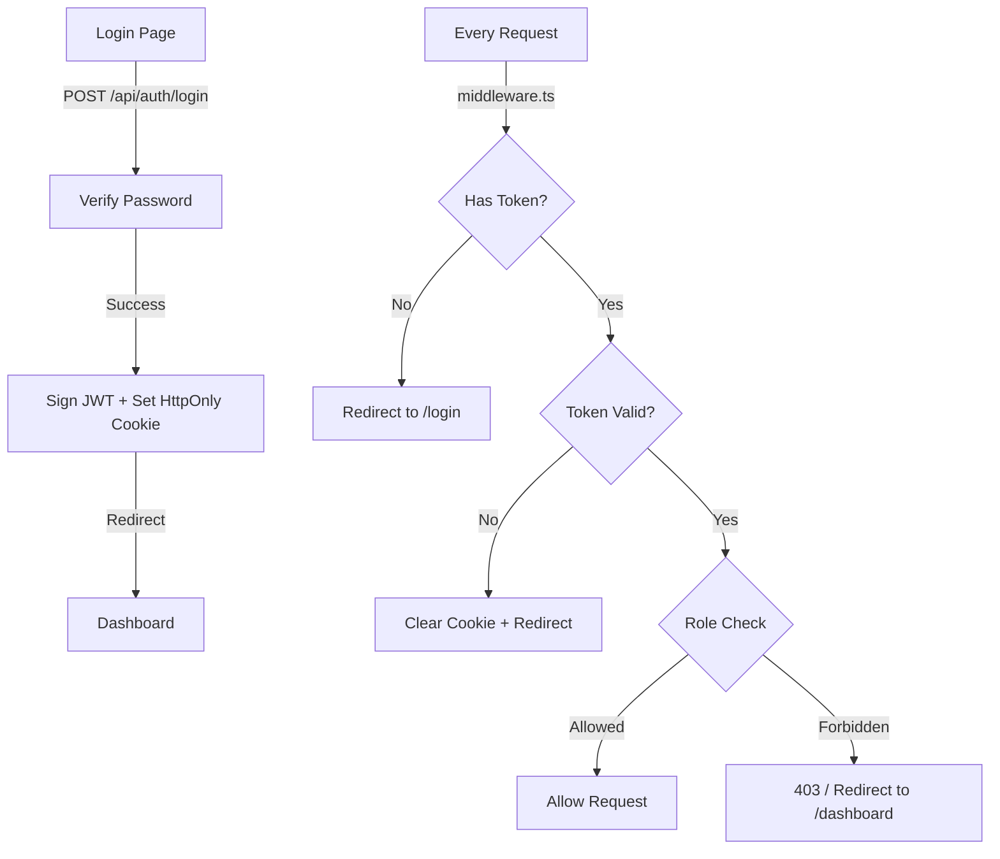
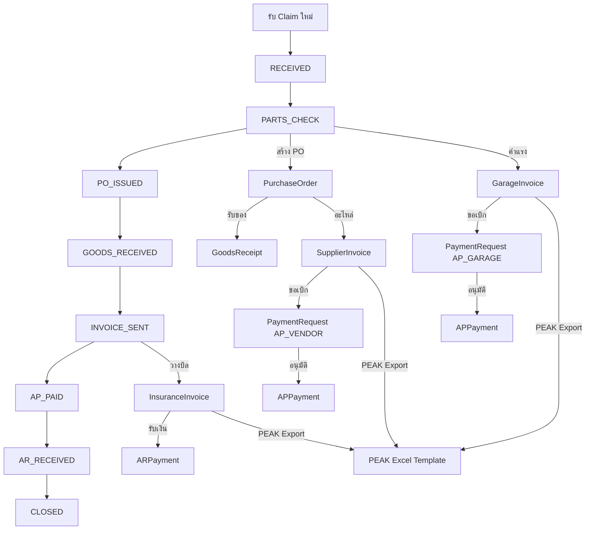

# Expert Body & Paint — Skill Code / Architecture Document

> **Last Updated:** 2026-05-28  
> **System:** Insurance Claim Management + PEAK Accounting Integration  
> **Stack:** Next.js 14.2 (App Router) • Prisma 5 • PostgreSQL • Cloudflare R2 • JWT Auth

---

## ⚠️ CRITICAL RULES

### วันที่ — ใช้ **พ.ศ. (Buddhist Era)** ทั้งระบบ
- **Display:** ทุก text แสดงวันที่ต้องใช้ `formatDate()` / `formatDateTime()` จาก `lib/date.ts` → แสดง **พ.ศ.** เสมอ (เช่น 17/05/2569)
- **DB:** เก็บเป็น ISO/AD (ค.ศ.) ปกติ ไม่ต้องแปลง
- **HTML Date Input:** `<input type="date">` แสดง ค.ศ. ตามระบบ (ควบคุมไม่ได้) แต่เมื่อบันทึกแล้วต้องแสดงเป็น พ.ศ.
- **ห้าม** ใช้ `toLocaleDateString()` หรือ format วันที่เองตรงๆ — ใช้ `lib/date.ts` เท่านั้น

### ห้ามใช้ Native JavaScript Dialog — ใช้ Modal เท่านั้น
- **ห้าม** ใช้ `alert()`, `confirm()`, `prompt()` ในทุกกรณี
- **ยืนยัน/ลบ:** ใช้ `setConfirmModal({ title, message, onConfirm })` state ที่มีอยู่ใน `page.tsx` หรือ `ConfirmDialog` จาก `@/components/dialogs.tsx`
- **แจ้งเตือน:** ใช้ `showToast(msg)` (สำเร็จ) หรือ `setErrorModalMsg(msg)` (error)
- **ทุก tab component** รับ `setConfirmModal` ผ่าน `ClaimTabProps`

### Number Input — ป้องกัน Leading Zero
- **ห้าม** ใช้ `value={number}` กับ `<Input type="number">` ตรงๆ → จะเกิด leading zero (เช่น "02000")
- **ใช้** `value={number || ''}` → เมื่อ value เป็น 0 จะแสดงช่องว่าง ให้ user พิมพ์ตัวเลขใหม่ได้สะอาด

---

## 1. Folder Structure

```
src/
├── app/
│   ├── api/                          # Route Handlers (REST API)
│   │   ├── ai/                       # AI extraction endpoints
│   │   │   ├── extract-claim/        # Extract claim from image
│   │   │   └── extract-supplier-invoice/  # Extract supplier invoice
│   │   ├── auth/                     # Authentication endpoints
│   │   │   ├── login/                # POST: JWT login
│   │   │   ├── logout/               # POST: Clear cookie
│   │   │   ├── me/                   # GET: Current user session
│   │   │   └── debug/                # GET: JWT debug (temp)
│   │   ├── claims/                   # Claim CRUD
│   │   │   ├── route.ts              # GET/POST list & create
│   │   │   ├── import/               # POST: Excel bulk import
│   │   │   └── [id]/                 # Claim sub-resources
│   │   │       ├── route.ts          # GET/PUT claim detail
│   │   │       ├── status/           # PATCH/PUT status change
│   │   │       ├── pos/              # GET/POST purchase orders
│   │   │       ├── supplier-invoices/# POST supplier invoices
│   │   │       ├── garage-invoices/  # POST garage invoices
│   │   │       ├── insurance-invoice/# POST/DELETE AR invoice
│   │   │       │   └── receive-payment/ # POST AR payment
│   │   │       ├── quotations/       # POST/PUT quotations
│   │   │       ├── parts/            # GET/POST claim parts
│   │   │       ├── labors/           # GET/POST claim labors
│   │   │       ├── payments/         # GET claim payments
│   │   │       ├── pnl/              # GET profit & loss
│   │   │       ├── peak-export/      # GET PEAK export data
│   │   │       ├── expenses/         # GET/POST/DELETE claim expenses
│   │   │       └── documents/        # GET/POST/DELETE claim documents
│   │   ├── dashboard/                # Dashboard stats
│   │   │   ├── route.ts             # GET main dashboard
│   │   │   ├── summary/             # GET dashboard KPIs
│   │   │   ├── by-status/           # GET claims by status
│   │   │   └── by-insurance/        # GET revenue by insurance
│   │   ├── garages/                  # GET garage vendors (filtered)
│   │   ├── insurances/               # GET/POST insurances
│   │   │   └── [id]/                # PUT/DELETE insurance detail
│   │   ├── invoices/                 # AR Invoice management
│   │   │   ├── route.ts             # GET invoice list
│   │   │   ├── [id]/status/         # PUT update status
│   │   │   ├── batch/               # GET batch fetch by IDs
│   │   │   ├── batch-status/        # POST batch status update
│   │   │   └── next-bn/             # POST generate next billing note no.
│   │   ├── parts-master/             # GET/POST parts catalog
│   │   ├── payment-requests/         # POST create + approve/reject
│   │   │   └── [id]/
│   │   │       ├── approve/          # POST approve PR
│   │   │       └── reject/           # POST reject PR
│   │   ├── payments/                 # Payment management
│   │   │   ├── route.ts             # GET payment list
│   │   │   └── [id]/                # PUT payment detail
│   │   ├── peak/                     # PEAK sync
│   │   │   ├── route.ts             # GET sync list
│   │   │   ├── export/              # POST export Excel
│   │   │   └── update-doc-no/       # POST update invoice number
│   │   ├── peak-export/
│   │   │   └── batch/               # GET batch PEAK export
│   │   ├── pos/                      # PO management (standalone)
│   │   │   └── [id]/
│   │   │       └── status/          # PATCH PO status (stub)
│   │   ├── reports/                  # GET report data
│   │   ├── settings/                 # System settings
│   │   │   ├── company/             # GET/PUT company profile
│   │   │   └── sequences/           # GET/PUT document sequences
│   │   ├── stats/                    # GET sidebar badge counts
│   │   ├── upload/                   # POST file upload to R2
│   │   ├── users/                    # User management (ADMIN only)
│   │   │   ├── route.ts             # GET/POST list & create users
│   │   │   └── [id]/                # PUT/DELETE user
│   │   └── vendors/                  # GET/POST vendors
│   │       └── [id]/                 # PUT/DELETE vendor detail
│   ├── claims/                       # Claims pages
│   │   ├── page.tsx                  # Claims list (239 lines)
│   │   ├── new/page.tsx              # New claim form (979 lines)
│   │   └── [id]/
│   │       ├── page.tsx              # Claim detail (~2,116 lines)
│   │       ├── tabs/                 # Extracted tab components
│   │       │   ├── index.ts          # Barrel export (7 tabs)
│   │       │   ├── types.ts          # Shared ClaimTabProps interface
│   │       │   ├── ClaimInfoTab.tsx   # Tab 1: Claim info (182 lines)
│   │       │   ├── ExpensesTab.tsx    # Tab: Additional expenses (243 lines)
│   │       │   ├── DocumentsTab.tsx   # Tab: File attachments (267 lines)
│   │       │   ├── PnLTab.tsx         # Tab: Profit & Loss (36 lines)
│   │       │   ├── TimelineTab.tsx    # Tab: Status timeline (41 lines)
│   │       │   ├── PaymentsTab.tsx    # Tab: Payment requests (87 lines)
│   │       │   └── InsuranceInvoiceTab.tsx  # Tab: AR invoice (175 lines)
│   │       └── pdf/[type]/           # PDF generation pages
│   ├── dashboard/page.tsx            # Dashboard (242 lines)
│   ├── insurances/                   # Insurance management
│   │   ├── page.tsx                  # Insurance list (119 lines)
│   │   └── [id]/page.tsx             # Insurance detail (326 lines)
│   ├── invoices/                     # AR Invoice management
│   │   ├── page.tsx                  # Invoice list (513 lines)
│   │   └── print-billing-note/       # Billing note print page (950 lines)
│   ├── login/page.tsx                # Login page (133 lines)
│   ├── parts-master/page.tsx         # Parts catalog (230 lines)
│   ├── payments/page.tsx             # Payment approvals (348 lines)
│   ├── peak/page.tsx                 # PEAK sync dashboard (804 lines)
│   ├── reports/page.tsx              # Reports (656 lines)
│   ├── settings/page.tsx             # System settings (671 lines)
│   ├── vendors/                      # Vendor management
│   │   ├── page.tsx                  # Vendor list (166 lines)
│   │   └── [id]/page.tsx             # Vendor detail (321 lines)
│   ├── layout.tsx                    # Root layout
│   └── globals.css                   # Global styles
├── components/
│   ├── sidebar.tsx                   # Main sidebar nav (dynamic counts + RBAC filtering)
│   ├── topbar.tsx                    # Top navigation bar (user dropdown + logout)
│   ├── client-layout.tsx             # Client-side layout wrapper (+ ToastProvider)
│   ├── toast-provider.tsx            # Global toast notification system
│   ├── dialogs.tsx                   # Shared ConfirmDialog + ErrorDialog
│   └── ui/                          # shadcn/ui components
│       ├── badge.tsx
│       ├── button.tsx
│       ├── card.tsx
│       ├── dialog.tsx
│       ├── input.tsx
│       ├── popover.tsx
│       ├── select.tsx
│       ├── skeleton.tsx
│       ├── table.tsx
│       ├── tabs.tsx
│       └── thai-date-picker.tsx      # Custom date picker with Buddhist era
├── lib/
│   ├── auth.ts                       # Auth helpers (hashPassword, verifyPassword, getSession, requireAuth, requireRole)
│   ├── jwt.ts                        # JWT sign/verify using Web Crypto API (HS256)
│   ├── date.ts                       # Centralized date formatting (พ.ศ.)
│   ├── types.ts                      # TypeScript interfaces (576 lines)
│   ├── utils.ts                      # Utility functions (64 lines)
│   ├── prisma.ts                     # Prisma singleton
│   ├── upload.ts                     # R2 upload helper
│   ├── r2.ts                         # R2 client config
│   └── mock/                         # Legacy mock data (NO LONGER IMPORTED — can be deleted)
├── middleware.ts                      # Auth middleware (JWT decode + RBAC per route)
└── prisma/
    └── schema.prisma                 # Database schema (638 lines, 35+ models)
```

---

## 2. Authentication & Authorization

### 2.1 Auth Flow


### 2.2 User Roles (RBAC)
| Role | Access |
|------|--------|
| **ADMIN** | ทุกเมนู + Settings + User Management |
| **ACCOUNTANT** | ทุกเมนูยกเว้น Settings + User Management |
| **STAFF** | Dashboard, Claims, Insurances, Vendors, Parts Master เท่านั้น |

### 2.3 Key Auth Files
- **`lib/auth.ts`**: `hashPassword()` (pbkdf2), `verifyPassword()`, `getSession()`, `requireAuth()`, `requireRole()`
- **`lib/jwt.ts`**: `signJWT()` / `verifyJWT()` using Web Crypto API (HS256, 8hr expiry)
- **`middleware.ts`**: Lightweight JWT decode (no crypto) + Role-based route filtering
- **Cookie:** `expert-token`, HttpOnly, SameSite=Lax, 8hr maxAge

---

## 3. Data Flow Overview



---

## 4. API Route Registry

| Route | Method | Purpose | Data Source |
|-------|--------|---------|-------------|
| `/api/auth/login` | POST | JWT login | Prisma ✅ |
| `/api/auth/logout` | POST | Clear auth cookie | Cookie ✅ |
| `/api/auth/me` | GET | Current user session | Prisma ✅ |
| `/api/auth/debug` | GET | JWT debug (temp) | In-memory ⚠️ |
| `/api/claims` | GET/POST | List/Create claims | Prisma ✅ |
| `/api/claims/import` | POST | Excel bulk import | Prisma ✅ |
| `/api/claims/[id]` | GET/PUT | Claim detail/update | Prisma ✅ |
| `/api/claims/[id]/status` | PATCH/PUT | Change claim status | Prisma ✅ |
| `/api/claims/[id]/pos` | GET/POST | Purchase orders | Prisma ✅ |
| `/api/claims/[id]/pos/[poId]` | PUT/PATCH | Edit/cancel PO | Prisma ✅ |
| `/api/claims/[id]/supplier-invoices` | POST | Create supplier invoice | Prisma ✅ |
| `/api/claims/[id]/garage-invoices` | POST | Create garage invoice | Prisma ✅ |
| `/api/claims/[id]/insurance-invoice` | POST/DELETE | Create/cancel AR invoice | Prisma ✅ |
| `/api/claims/[id]/insurance-invoice/receive-payment` | POST | Record AR payment | Prisma ✅ |
| `/api/claims/[id]/quotations` | POST/PUT | Create/update quotation | Prisma ✅ |
| `/api/claims/[id]/peak-export` | GET | Per-claim PEAK export | Prisma ✅ |
| `/api/claims/[id]/parts` | GET/POST | Claim parts | Prisma ✅ |
| `/api/claims/[id]/labors` | GET/POST | Claim labors | Prisma ✅ |
| `/api/claims/[id]/payments` | GET | Claim payments | Prisma ✅ |
| `/api/claims/[id]/pnl` | GET | Claim P&L | Prisma ✅ |
| `/api/claims/[id]/expenses` | GET/POST/DELETE | Claim additional expenses | Prisma ✅ |
| `/api/claims/[id]/documents` | GET/POST/DELETE | Claim file attachments | Prisma ✅ |
| `/api/dashboard` | GET | Main dashboard data | Prisma ✅ |
| `/api/dashboard/summary` | GET | Dashboard KPIs | Prisma ✅ |
| `/api/dashboard/by-status` | GET | Claims by status | Prisma ✅ |
| `/api/dashboard/by-insurance` | GET | Revenue by insurance | Prisma ✅ |
| `/api/garages` | GET | Garage vendors (vendorType=GARAGE) | Prisma ✅ |
| `/api/insurances` | GET/POST | Insurance CRUD | Prisma ✅ |
| `/api/insurances/[id]` | PUT/DELETE | Insurance detail | Prisma ✅ |
| `/api/invoices` | GET | AR invoice list | Prisma ✅ |
| `/api/invoices/[id]/status` | PUT | Update AR status | Prisma ✅ |
| `/api/invoices/batch` | GET | Batch fetch invoices by IDs | Prisma ✅ |
| `/api/invoices/batch-status` | POST | Batch update AR status | Prisma ✅ |
| `/api/invoices/next-bn` | POST | Generate next billing note number | Prisma ✅ (DocumentSequence) |
| `/api/payment-requests` | POST | Create payment request | Prisma ✅ |
| `/api/payment-requests/[id]/approve` | POST | Approve PR | Prisma ✅ |
| `/api/payment-requests/[id]/reject` | POST | Reject PR | Prisma ✅ |
| `/api/payments` | GET | Payment requests list | Prisma ✅ |
| `/api/payments/[id]` | PUT | Update payment status | Prisma ✅ |
| `/api/peak` | GET | PEAK sync list (AR + AP) | Prisma ✅ |
| `/api/peak/export` | POST | Export PEAK Excel data | Prisma ✅ |
| `/api/peak/update-doc-no` | POST | Update invoice document number | Prisma ✅ |
| `/api/peak-export/batch` | GET | Batch PEAK export | Prisma ✅ |
| `/api/pos/[id]/status` | PATCH | Update PO status (stub) | ⚠️ Stub |
| `/api/reports` | GET | Reports (filter: year, insurance, vendor) | Prisma ✅ |
| `/api/settings/company` | GET/PUT | Company profile | Prisma ✅ |
| `/api/settings/sequences` | GET/PUT | Document sequences | Prisma ✅ |
| `/api/stats` | GET | Sidebar badge counts | Prisma ✅ |
| `/api/users` | GET/POST | User CRUD (ADMIN only) | Prisma ✅ |
| `/api/users/[id]` | PUT/DELETE | User detail (ADMIN only) | Prisma ✅ |
| `/api/vendors` | GET/POST | Vendor CRUD | Prisma ✅ |
| `/api/vendors/[id]` | PUT/DELETE | Vendor detail | Prisma ✅ |
| `/api/parts-master` | GET/POST | Parts catalog | Prisma ✅ |
| `/api/upload` | POST | File upload to R2 | R2 ✅ |

> **⚠️ STUB API ROUTES** — Only 1 route still returns fake/in-memory data:
> - `/api/pos/[id]/status` — PO status update stub

---

## 5. Prisma Schema Overview

### Key Models (638 lines, 35+ models)

| Model | Purpose | Key Relations |
|-------|---------|---------------|
| `Claim` | Central entity | Has many Parts, Labors, POs, Invoices, Expenses, Documents |
| `ClaimPart` | Parts per claim | Belongs to Claim, optional PartMaster link |
| `ClaimLabor` | Labor items per claim | Belongs to Claim |
| `ClaimExpense` | Additional expenses (shipping, etc.) | Belongs to Claim |
| `ClaimDocument` | File attachments per claim | Belongs to Claim |
| `PurchaseOrder` | Purchase orders | Belongs to Claim + Vendor |
| `POItem` | PO line items | Belongs to PurchaseOrder |
| `GoodsReceipt` | Goods received | 1:1 with PurchaseOrder |
| `DeliveryOrder` | Delivery confirmation | 1:1 with GoodsReceipt |
| `SupplierInvoice` | Vendor invoices (AP) | Belongs to Claim + Vendor |
| `SupplierInvoiceItem` | Invoice line items | Belongs to SupplierInvoice |
| `GarageInvoice` | Garage labor invoices (AP) | Belongs to Claim + Vendor (garage) |
| `GarageInvoiceItem` | Garage invoice items | Belongs to GarageInvoice |
| `InsuranceInvoice` | AR billing to insurance | 1:1 with Claim (`@unique`) |
| `PaymentRequest` | Payment approval workflow | Belongs to Claim + optional invoice links |
| `BillReceipt` | Physical bill receipt tracking | 1:1 with PaymentRequest |
| `APPayment` | AP payment record | Links to SupplierInvoice or PO or PaymentRequest |
| `ARPayment` | AR payment record | Links to InsuranceInvoice + PaymentRequest |
| `Insurance` | Insurance companies | Has many Claims |
| `Vendor` | Parts suppliers + Garages | Dual role via `vendorType` (PARTS/GARAGE) |
| `PartMaster` | Parts catalog | Has PartVendorPrice[], ClaimPart[] |
| `PartVendorPrice` | Vendor-specific pricing | Links PartMaster to Vendor |
| `Quotation` | Quote documents | Belongs to Claim, has QuotationLabor[] + QuotationPart[] |
| `CompanyProfile` | Company settings | Singleton (findFirst) |
| `DocumentSequence` | Auto-numbering | Unique docType (CLAIM, PO_PARTS, QUOTATION, INVOICE, etc.) |
| `ClaimStatusLog` | Status change audit trail | Belongs to Claim |
| `ExtractionLog` | AI extraction edit log | Belongs to Claim |
| `StockMovement` | Inventory movements | Standalone |
| `StockBalance` | Current stock levels | Standalone, unique partNo |
| `User` | System users | Roles: ADMIN, ACCOUNTANT, STAFF |

### Enums
- `ClaimStatus`: RECEIVED → PARTS_CHECK → PO_ISSUED → GOODS_RECEIVED → INVOICE_SENT → AP_PAID → AR_RECEIVED → CLOSED | CANCELLED
- `POType`: PARTS | LABOR
- `DeliveryMode`: DIRECT_TO_GARAGE | SELF_DELIVERY
- `POStatus`: DRAFT | SENT | RECEIVED | CANCELLED
- `ARStatus`: PENDING | SENT | PARTIAL | PAID | CANCELLED
- `QuotationStatus`: DRAFT | SENT | APPROVED | REJECTED | SUPERSEDED
- `PaymentRequestType`: AP_VENDOR | AP_GARAGE | AR
- `ApprovalStatus`: PENDING_APPROVAL | APPROVED | REJECTED
- `PartPaymentStatus`: PENDING | INVOICED | PR_SENT | PAID
- `LaborPaymentStatus`: PENDING | INVOICED | PR_SENT | PAID
- `APPayType`: VENDOR | GARAGE
- `VendorType`: PARTS | GARAGE
- `UserRole`: ADMIN | ACCOUNTANT | STAFF
- `PartMasterSource`: AUTO | MANUAL

---

## 6. Bug Report — Completed Fixes

### ✅ Fixed (2026-05-17)

| # | Fix | Status |
|---|-----|--------|
| 1 | Removed dead `mockPaymentRequests` import from `claims/[id]/page.tsx` | ✅ Done |
| 2-8 | Migrated all 10 mock-dependent API routes to Prisma | ✅ Done |
| 9 | `settings/page.tsx` — migrated from mock to API fetch | ✅ Done |
| 10 | `pdf/[type]/page.tsx` — removed mock company profile | ✅ Done |
| 11 | Replaced all 4 `window.location.reload()` with `refreshClaim()` | ✅ Done |
| 14 | `handleSendQuotation` now persists to DB via PUT | ✅ Done |
| 15 | Supplement SUPERSEDED status now persisted to DB | ✅ Done |
| 16 | `xlsx` changed to dynamic import on both PEAK + Reports pages | ✅ Done |
| R1 | Reports: Added global filter bar (year/insurance/vendor) | ✅ Done |
| R2 | Reports: Added Export Excel button for all 4 report tabs | ✅ Done |
| R3 | Reports: Removed all `Math.random()`, replaced with real Prisma data | ✅ Done |
| R4 | Reports: Added per-tab search, summary cards, summary rows | ✅ Done |
| Q1 | Added PUT handler for quotations API (status updates) | ✅ Done |

### ✅ Fixed (2026-05-28)

| # | Fix | Status |
|---|-----|--------|
| 18 | Monolithic `claims/[id]/page.tsx` decomposed from 2,116 lines to 365 lines by extracting all modals (CreatePOModal, CreateQuotationModal, UploadSupplierInvoiceModal, CreatePRModal, RejectPRModal, StatusChangeModal) and tabs (PartsTab, POTab, SupplierInvTab). | ✅ Done |
| N1 | Optimized New Claim page `/claims/new` (reduced from 979 to 503 lines) by extracting form review section to `ClaimFormReview.tsx` and lazy loading it using `next/dynamic` (First Load JS size reduced from 156 kB to 113 kB, chunk size 7.17 kB). | ✅ Done |
| DB1 | Added performance database indexes (`@@index`) for Claim, ClaimPart, ClaimLabor, PurchaseOrder, SupplierInvoice, InsuranceInvoice, GarageInvoice, PaymentRequest, and ClaimExpense models. | ✅ Done |
| CP1 | Added client-side image compression helper `compressImageIfNeeded` inside `src/lib/upload.ts` to automatically resize images (>150KB, up to 2048px width, JPEG 88% quality, PNG transparency preserved) for all R2 file uploads. | ✅ Done |
| RP1 | Optimized reports API `/api/reports` to use database-level aggregations (`groupBy` + `_sum` + `_count`) and selective `select` queries, replacing memory-heavy client-side reduction. | ✅ Done |
| SN1 | Added sequential PO and Quotation number generation using atomic transaction updates on the `DocumentSequence` database model, replacing timestamp-based base36 strings. | ✅ Done |
| DL1 | Removed 4 unused dead mock routes `/api/payments/ap`, `/api/payments/ar`, `/api/pos/[id]/gr`, and `/api/gr/[id]/do`. | ✅ Done |
| RT1 | Refactored duplicate toast and modal overlay states in page tabs (like `POTab.tsx` and `DocumentsTab.tsx`) to utilize the parent's global confirm dialog and toast notification handler. | ✅ Done |

### 🟡 Remaining (Lower Priority)

| # | File | Issue | Impact |
|---|------|-------|--------|
| 17 | `sidebar.tsx` | **No retry for stats fetch** — Silent failure shows 0 badges. | Silent failure |
| 21 | `types.ts` usage | **`any` used 15+ times** — `useState<any[]>()` everywhere. | Type safety |
| 22 | `invoices/page.tsx:96` | **eslint-disable** suppresses `exhaustive-deps`. | Lint suppression |
| 23 | `pos/[id]/status` | **1 STUB API** — Rest 4 stub APIs successfully deleted. | Data not saved |

---

## 7. Componentization Status

### ✅ Completed — Extracted Tab Components (7 tabs)

| Component | File | Lines | Description |
|-----------|------|-------|-------------|
| `ClaimInfoTab` | `tabs/ClaimInfoTab.tsx` | 182 | Claim + car info |
| `ExpensesTab` | `tabs/ExpensesTab.tsx` | 243 | Additional expenses management |
| `DocumentsTab` | `tabs/DocumentsTab.tsx` | 267 | File attachments |
| `InsuranceInvoiceTab` | `tabs/InsuranceInvoiceTab.tsx` | 175 | AR billing |
| `PaymentsTab` | `tabs/PaymentsTab.tsx` | 87 | Payment requests |
| `PnLTab` | `tabs/PnLTab.tsx` | 36 | Profit & Loss |
| `TimelineTab` | `tabs/TimelineTab.tsx` | 41 | Status timeline |

### ✅ Completed — Shared Components

| Component | File | Description |
|-----------|------|-------------|
| `ToastProvider` | `components/toast-provider.tsx` | Global toast notification system |
| `ConfirmDialog` | `components/dialogs.tsx` | Shared confirm modal |
| `ErrorDialog` | `components/dialogs.tsx` | Shared error modal |
| `ThaiDatePicker` | `components/ui/thai-date-picker.tsx` | Date picker with Buddhist era display |

### 🟡 Still Remaining in Main Component

The `claims/[id]/page.tsx` (~2,116 lines) still contains:
- PO creation/edit/cancel modals and handlers
- Supplier invoice upload and modal
- Garage invoice upload and modal
- Quotation creation and supplement modals
- Status change modal
- Searchable select component (inline)
- 30+ state variables

---

## 8. Best Practices Improvements

### 8.1 ~~Remove All Mock Data Dependencies~~ ✅ COMPLETED

All Prisma-backed API routes now use real data.
The `lib/mock/` directory is no longer imported anywhere and can be safely deleted.

### 8.2 API Error Handling ✅ IMPLEMENTED

All new/rewritten API routes now use try/catch with proper error responses.

### 8.3 ~~Replace `window.location.reload()` with State Refresh~~ ✅ COMPLETED

`refreshClaim()` function added to claims detail page. All reload calls replaced.

### 8.4 ~~Dynamic Import for `xlsx`~~ ✅ COMPLETED

Both PEAK page and Reports page now use `await import('xlsx')` for dynamic loading.

### 8.5 Document Number Generation ✅ COMPLETED

**PO, Quotation, and Billing Note** now use `DocumentSequence` model with an atomic `$transaction` increment:
```typescript
// quotation API route uses $transaction for atomic increment:
const seq = await prisma.$transaction(async (tx) => {
  let s = await tx.documentSequence.findUnique({ where: { docType: 'QUOTATION' } })
  // ... create if not exists ...
  const nextNo = s.lastNo + 1
  await tx.documentSequence.update({ where: { id: s.id }, data: { lastNo: nextNo } })
  return { prefix: s.prefix, number: nextNo }
})
```

### 8.6 Type Safety (TODO)

Replace all `useState<any[]>([])` with proper types from `types.ts`.

### 8.7 Create Shared `useFetch` Hook (TODO)

```typescript
// hooks/useFetch.ts
export function useFetch<T>(url: string) {
  const [data, setData] = useState<T | null>(null)
  const [loading, setLoading] = useState(true)
  const [error, setError] = useState<string | null>(null)

  const refetch = useCallback(async () => {
    setLoading(true)
    try {
      const res = await fetch(url)
      if (!res.ok) throw new Error(`HTTP ${res.status}`)
      setData(await res.json())
    } catch (e: any) {
      setError(e.message)
    } finally {
      setLoading(false)
    }
  }, [url])

  useEffect(() => { refetch() }, [refetch])
  return { data, loading, error, refetch }
}
```

### 8.8 Migrate Stub APIs to Prisma (TODO)

5 API routes still return fake data:
- `/api/payments/ap` — Should create `APPayment` in Prisma
- `/api/payments/ar` — Should create `ARPayment` in Prisma
- `/api/pos/[id]/gr` — Should create `GoodsReceipt` in Prisma
- `/api/pos/[id]/status` — Should update `PurchaseOrder.status` in Prisma
- `/api/gr/[id]/do` — Should create `DeliveryOrder` in Prisma

---

## 9. PEAK Integration Architecture

### Export Flow
1. User selects invoices on `/peak` page
2. Frontend calls `POST /api/peak/export` with `{ type: 'ar'|'ap', ids: [...] }`
3. API fetches invoices from Prisma, maps to PEAK template columns
4. Returns JSON rows + filename
5. Frontend converts to Excel using `xlsx` library (dynamically imported)
6. Browser downloads the `.xlsx` file

### Document Number Update
- `POST /api/peak/update-doc-no` allows editing invoice numbers
- Handles 3 types: AR (InsuranceInvoice), SUPPLIER (SupplierInvoice), GARAGE (GarageInvoice)
- Checks for duplicates before updating

### Sync Tracking
- `isSynced` + `syncedAt` fields on SupplierInvoice, GarageInvoice, InsuranceInvoice, ClaimExpense

### Template Columns (from real PEAK templates)

**AR (template_ar.xlsx):**
```
ลำดับที่* | วันที่เอกสาร | เลขที่เอกสาร | อ้างอิงถึง | ลูกค้า | 
เลขทะเบียน 13 หลัก | เลขสาขา 5 หลัก | เป็นใบกำกับภาษี | ประเภทราคา | 
สินค้า/บริการ | บัญชี | คำอธิบาย | จำนวน | ราคาต่อหน่วย | ส่วนลดต่อหน่วย | 
อัตราภาษี | ถูกหัก ณ ที่จ่าย(ถ้ามี) | หมายเหตุ | กลุ่มจัดประเภท
```

**AP (template_ap.xlsx):**
```
ลำดับที่* | วันที่เอกสาร | อ้างอิงถึง | ผู้รับเงิน/คู่ค้า | 
เลขทะเบียน 13 หลัก | เลขสาขา 5 หลัก | เลขที่ใบกำกับฯ (ถ้ามี) | 
วันที่ใบกำกับฯ (ถ้ามี) | วันที่บันทึกภาษีซื้อ (ถ้ามี) | ประเภทราคา | 
สินค้า/บริการ | บัญชี | คำอธิบาย | จำนวน | ราคาต่อหน่วย | อัตราภาษี | 
หัก ณ ที่จ่าย (ถ้ามี) | ชำระโดย | จำนวนเงินที่ชำระ | ภ.ง.ด. (ถ้ามี) | 
หมายเหตุ | กลุ่มจัดประเภท
```

### Account Codes
```
ACCOUNT_REVENUE_LABOR = '41101'  // รายได้ค่าแรง
ACCOUNT_REVENUE_PARTS = '41102'  // รายได้ค่าอะไหล่
ACCOUNT_COST_LABOR    = '51101'  // ต้นทุนค่าแรง
ACCOUNT_COST_PARTS    = '51102'  // ต้นทุนค่าอะไหล่
```

---

## 10. Invoice & Billing System

### Billing Note Flow
1. User selects multiple AR invoices on `/invoices` page
2. Click "สร้างใบวางบิล" → calls `POST /api/invoices/next-bn` to generate sequential BN number
3. Opens `/invoices/print-billing-note` page with selected invoice IDs
4. Fetches invoices via `GET /api/invoices/batch?ids=...`
5. Renders printable billing note with company profile from `/api/settings/company`

### Batch Status Update
- `POST /api/invoices/batch-status` updates multiple AR invoices at once (e.g., mark all as SENT)

---

## 11. Performance & Build Metrics

### Build Output (2026-05-27)
```
Total Pages: ~35 pages + 60 API routes
First Load JS shared: 87.4 kB
Middleware: 26.9 kB

Largest Pages by JS:
├ /claims/new         50.3 kB  (156 kB total)
├ /claims/[id]        28.9 kB  (140 kB total)
├ /invoices/print-billing-note  13.3 kB (109 kB total)
├ /settings           9.44 kB  (111 kB total)
├ /peak               7.55 kB  (109 kB total)
├ /invoices           7.28 kB  (118 kB total)
├ /reports            6.9 kB   (111 kB total)
├ /payments           6.92 kB  (108 kB total)
```

### Performance Notes
- ✅ Build succeeds without errors
- ✅ `xlsx` is dynamically imported (not in shared bundle)
- ✅ Decomposed monolithic `/claims/[id]/page.tsx` (reduced to 365 lines)
- ✅ Optimized `/claims/new/page.tsx` (reduced to 503 lines, Page JS size dropped to 7.17 kB, First Load JS 113 kB) via lazy dynamic imports
- ✅ Added PostgreSQL indexes for key query, filter, and relational fields to prevent full table scans

### Missing Indexes (Performance)
- ✅ Resolved (2026-05-28) — Added database performance indexes on Claim, ClaimPart, ClaimLabor, PurchaseOrder, SupplierInvoice, InsuranceInvoice, GarageInvoice, PaymentRequest, and ClaimExpense models.

---

## 12. Improvement Roadmap

| Phase | Task | Status |
|-------|------|--------|
| **Phase 1** | ~~Remove all mock data from API routes, migrate to Prisma~~ | ✅ Done |
| **Phase 2** | ~~Authentication system (JWT + Login + Middleware + RBAC)~~ | ✅ Done |
| **Phase 3** | ~~Split `claims/[id]/page.tsx` into tab components and subcomponents~~ | ✅ Done |
| **Phase 4** | ~~Replace `window.location.reload()` with state refresh~~ | ✅ Done |
| **Phase 5** | ~~Fix PO/QT/INV collision-prone numbering (timestamp-based)~~ | ✅ Done (2026-05-28) |
| **Phase 6** | Add proper TypeScript types (remove `any`) | 🔲 Pending |
| **Phase 7** | ~~Dynamic import `xlsx`, optimize bundle~~ | ✅ Done |
| **Phase 8** | ~~Create shared Toast + ConfirmDialog + ErrorDialog~~ | ✅ Done |
| **Phase 9** | Add DB indexes for performance | ✅ Done (2026-05-28) |
| **Phase 10** | ~~Reports: Add Filter + Export Excel~~ | ✅ Done |
| **Phase 11** | ~~Reports: Fix fake data (Math.random)~~ | ✅ Done |
| **Phase 12** | ~~Reports: Add Income/Expense Detail tab~~ | ✅ Done |
| **Phase 13** | ~~Date format standardization (ค.ศ. AD system-wide)~~ | ✅ Done |
| **Phase 14** | ~~Insurance Invoice: Add PDF/PEAK download buttons~~ | ✅ Done |
| **Phase 15** | ~~AR Receive: Add date picker for payment date~~ | ✅ Done |
| **Phase 16** | ~~User Management (CRUD + roles)~~ | ✅ Done |
| **Phase 17** | ~~Login Page + JWT Auth~~ | ✅ Done |
| **Phase 18** | ~~Expenses & Documents tabs for Claims~~ | ✅ Done |
| **Phase 19** | ~~Excel Import for Claims~~ | ✅ Done |
| **Phase 20** | ~~Billing Note print page~~ | ✅ Done |
| **Phase 21** | ~~Invoice batch operations (batch fetch + status update)~~ | ✅ Done |
| **Phase 22** | ~~PEAK doc number editing~~ | ✅ Done |
| **Phase 23** | ~~Insurance & Vendor detail pages~~ | ✅ Done |
| **Phase 24** | Migrate remaining stub APIs to Prisma / cleanup | 🟡 Partial (deleted 4 stubs) |
| **Phase 25** | Delete `lib/mock/` directory | 🔲 Pending |

---

## 13. Environment & Deploy

- **Dev:** `npm run dev` → `http://localhost:3000`
- **Build:** `prisma generate && next build`
- **Deploy:** `git push` → `bash deploy.sh` (SSH + Docker multi-stage build)
- **DB:** PostgreSQL via `DATABASE_URL`
- **Storage:** Cloudflare R2 via `R2_*` env vars
- **AI:** Claude/OpenRouter via `ANTHROPIC_API_KEY` or `OPENROUTER_API_KEY`
- **Auth:** JWT via `JWT_SECRET` env var (default fallback exists for dev)
- **Stack:** Next.js 14.2.35, Prisma 5.22.0, React 18, TailwindCSS 3.4
